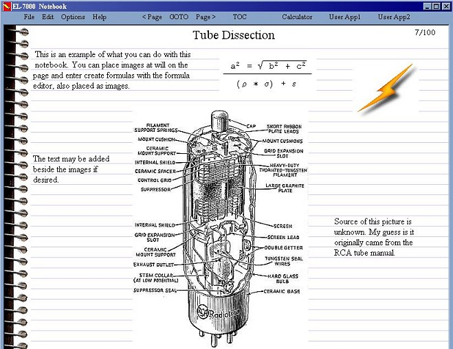



## Lab Notebook

### Description

Using a textbox with z-order to overlay images on text.
 
### More Info
 
Text editor with a twist, overlay lines and embed images in textboxes to give the illusion of a notebook page, also demonstrates how to turn a math equation into an image file.

             |
---                |---
**Submitted On**   |2002-06-17 09:35:14
**By**             |[Vic Richardson](https://github.com/Planet-Source-Code/PSCIndex/blob/master/ByAuthor/vic-richardson.md)
**Level**          |Intermediate
**User Rating**    |4.9 (34 globes from 7 users)
**Compatibility**  |VB 6\.0
**Category**       |[Complete Applications](https://github.com/Planet-Source-Code/PSCIndex/blob/master/ByCategory/complete-applications__1-27.md)
**World**          |[Visual Basic](https://github.com/Planet-Source-Code/PSCIndex/blob/master/ByWorld/visual-basic.md)
**Archive File**   |[Lab\_Notebo954896172002\.zip](https://github.com/Planet-Source-Code/vic-richardson-lab-notebook__1-35861/archive/master.zip)

